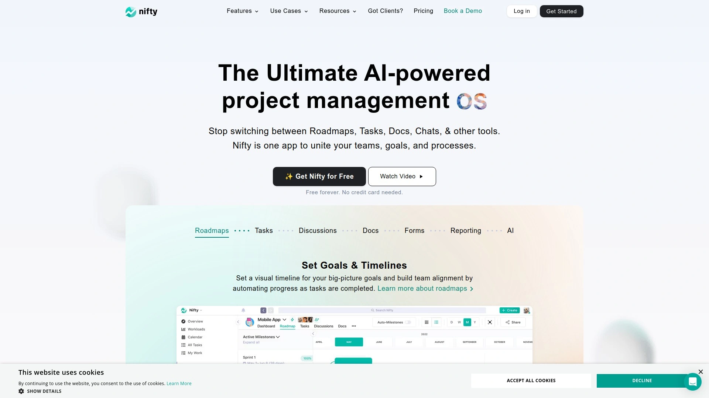
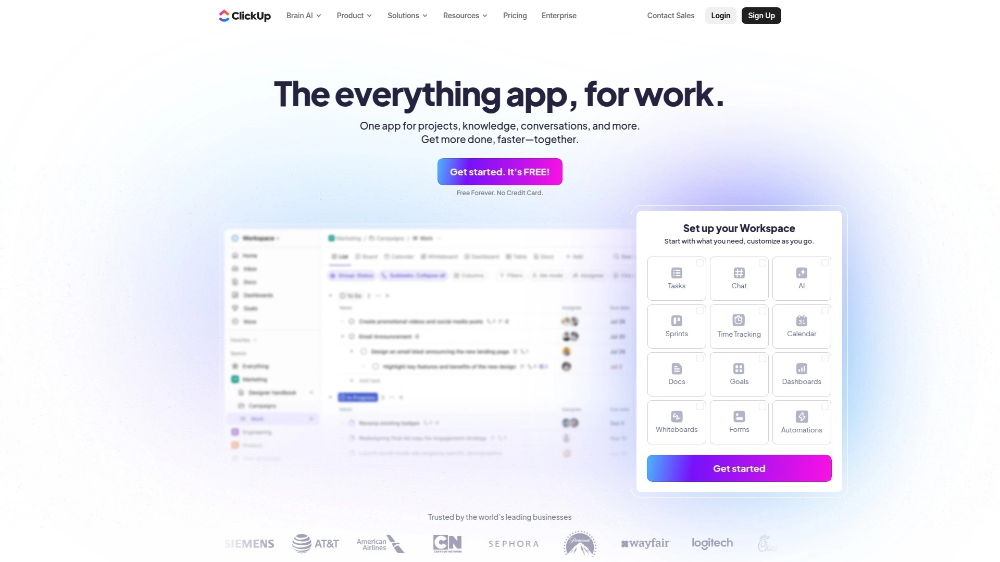
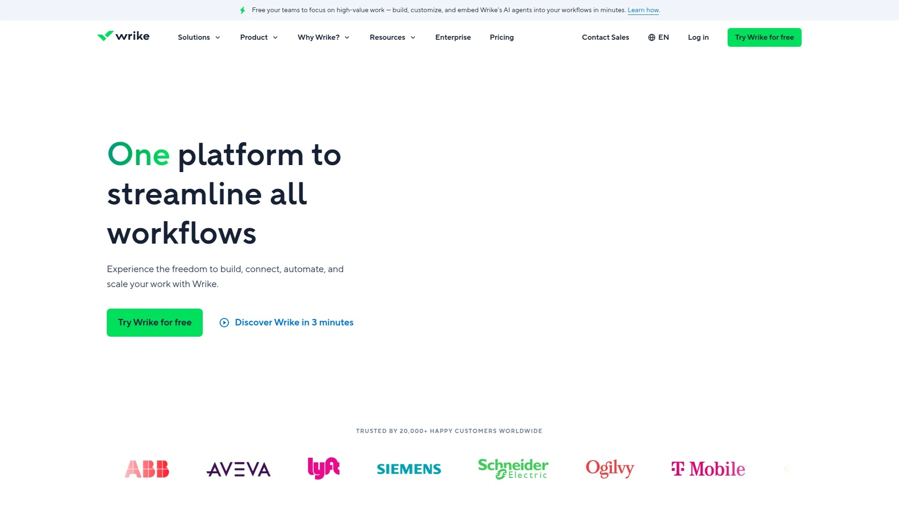
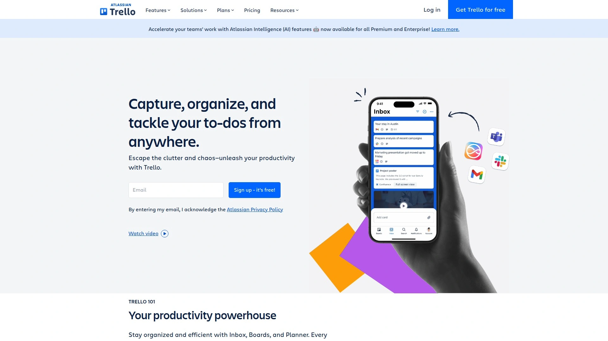
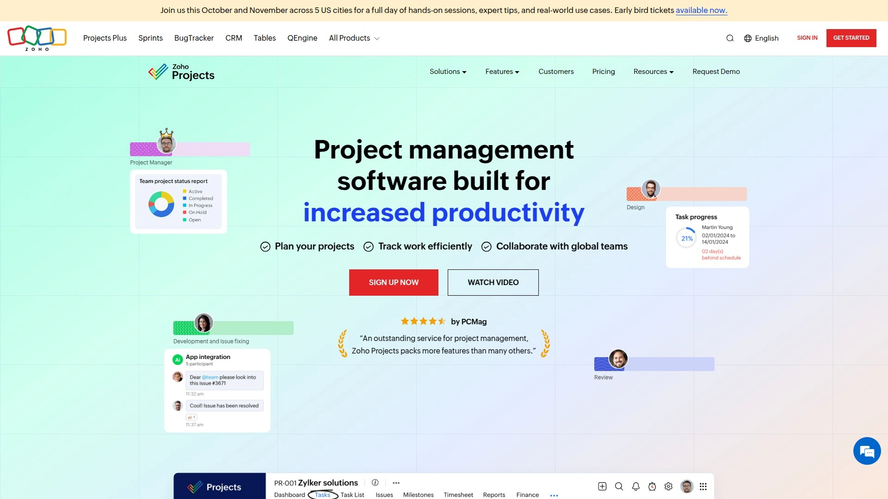
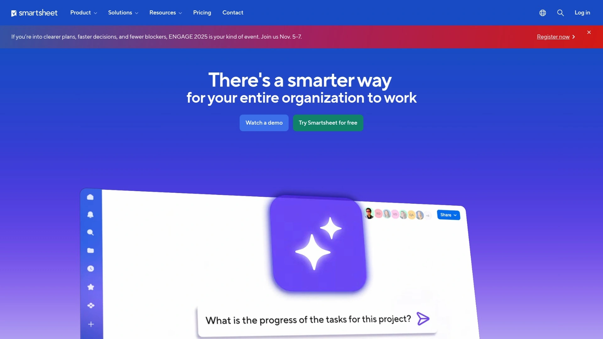

# 2025's 8 Best Project Management Tools

Let's be real, juggling a dozen different apps to keep a project on track is a recipe for chaos. Between endless email chains, misplaced files, and team members who seem to exist in different time zones, getting everyone on the same page feels like a full-time job. A solid project management tool isn't just a nice-to-have; it's the command center that streamlines your workflow, boosts team collaboration, and stops things from falling through the cracks. This list breaks down the top platforms that can bring order to your projects and sanity back to your work life.

## **[Nifty](https://niftypm.com)**

The ultimate all-in-one hub that unites teams, goals, and processes.

Nifty is designed for teams tired of switching between different tools. It consolidates roadmaps, tasks, documents, and team chats into a single, intuitive workspace. Think of it as the central nervous system for your projects, from big-picture planning to daily to-do lists.

One of its standout features is **Roadmaps**, which provides a visual timeline for your goals and automatically updates progress as tasks are completed. This keeps everyone aligned without constant check-in meetings. Its task management is incredibly flexible, offering Kanban, List, Timeline, and Calendar views to suit any workflow. Plus, with built-in docs, native forms, and powerful AI features to streamline your work, Nifty positions itself as a complete solution for teams of all sizes, from engineering to client management.

## **[ClickUp](https://clickup.com)**

An everything-in-one platform for teams that want endless customization.

ClickUp's main selling point is its ambition to be the one app to replace them all. It’s packed with features, including tasks, docs, whiteboards, and spreadsheets, all within a single platform. This makes it a powerhouse for teams that need to manage complex projects with lots of moving parts.

**Core Features:**
* **Multiple Views:** Like Nifty, it offers over 15 different ways to view your work, ensuring every team member can use a layout that makes sense to them.
* **Customization:** You can customize almost everything, from task statuses to custom fields, tailoring the platform to your exact needs.
* **Automation:** Its automation features help eliminate repetitive manual work, saving time and reducing errors.

While its extensive feature set can have a bit of a learning curve, its free plan is one of the most generous available, making it a great option for teams on a budget.

## **[monday.com](https://monday.com)**

The go-to tool for visual workflow management and team collaboration.

If your team thinks visually, monday.com is a dream come true. It’s famous for its bright, colorful, and highly intuitive interface that makes tracking project progress feel less like work. It's especially popular with marketing, creative, and sales teams who thrive on visual planning.

The platform is built around "Work OS," allowing you to create custom workflows for just about anything. You can manage ad campaigns, sales pipelines, or development sprints using its flexible boards, dashboards, and automation recipes. Its strength lies in making complex information easy to digest at a glance, which helps keep cross-functional teams aligned and informed.

## **[Asana](https://asana.com)**

Best-in-class for strategic planning and straightforward task management.

Asana strikes a perfect balance between power and simplicity, making it a favorite for teams of all sizes. Its design philosophy is clean and user-friendly, helping teams get organized without feeling overwhelmed. Asana excels at turning strategic goals into actionable tasks.

With features like **Portfolios** and **Goals**, managers can get a high-level overview of all projects and track progress toward company objectives. It offers various views like Lists, Boards, and Timelines, and its automation rules can handle routine tasks, freeing up your team to focus on more important work. If your main goal is clear task organization and ensuring everyone knows who is doing what by when, Asana is hard to beat.

## **[Wrike](https://wrike.com)**

An enterprise-grade platform built for complex, cross-departmental projects.

Wrike is a heavy-hitter designed for larger teams and organizations that need robust security and powerful analytics. It’s a highly versatile tool trusted by enterprises for managing complex workflows and gaining deep visibility into project performance.

Its interactive Gantt charts are a major draw for project managers who need to handle intricate dependencies and timelines. Wrike also offers custom request forms to standardize intake processes, detailed dashboards for real-time reporting, and a proofing tool for creative teams to streamline feedback cycles. It's an excellent choice for teams that need granular control and powerful reporting capabilities to manage large-scale initiatives.

## **[Trello](https://trello.com)**

The undisputed champion of simple, visual Kanban-style organization.

Trello is beautifully simple, and that’s its superpower. It uses a system of boards, lists, and cards to help individuals and small teams organize tasks in a clear, visual way. If you love the satisfaction of moving a task from "To Do" to "Done," Trello will feel like home.

It's perfect for managing smaller projects, personal to-do lists, or simple team workflows where you don't need the complexity of Gantt charts or detailed reporting. While it may lack the advanced features of other tools on this list, its simplicity makes it incredibly easy to adopt. You can get a new project board up and running in minutes, making it a fantastic tool for quick collaboration and straightforward task tracking.

## **[Zoho Projects](https://projects.zoho.com)**

A powerful, budget-friendly option for end-to-end work management.

Part of the extensive Zoho ecosystem, Zoho Projects is a feature-rich platform that offers incredible value, especially for small to mid-sized teams. It stands out for its solid task management, dependency handling, and time-tracking capabilities.

For teams that are already using other Zoho products (like Zoho CRM), the seamless integration is a huge plus. The platform includes everything from Gantt charts and resource utilization reports to issue tracking and budget forecasting, making it a comprehensive solution for managing projects from start to finish. Its free plan is great for small teams just getting started.

## **[Smartsheet](https://smartsheet.com)**

The perfect hybrid of a spreadsheet and a powerful project management tool.

If your team lives in spreadsheets but needs more power, Smartsheet is the answer. It combines the familiar grid interface of Excel with robust project management features like automation, reporting, and multiple views (Grid, Gantt, Card, Calendar).

Smartsheet is ideal for teams that manage data-heavy projects and need the flexibility of a spreadsheet with the structure of a PM tool. You can build powerful, automated workflows, create real-time dashboards, and manage resources without ever leaving the spreadsheet-like environment. It's a great way to level up your project management without forcing your team to abandon a format they already know and love.

### FAQ

**How do I choose the right project management tool?**
Start by identifying your team's biggest pain point. If you need simple task tracking, a tool like Trello is a great start. For complex projects requiring detailed timelines and resource management, look at options like Wrike or Nifty. Always take advantage of free trials to see which interface your team prefers.

**Can these tools integrate with the software we already use?**
Yes, most modern project management platforms offer a wide range of integrations with popular tools like Slack, Google Drive, Salesforce, and Microsoft Teams. Before you commit, check the platform's integration library to ensure it connects with the apps your team relies on.

**What's the best way to get my team on board with a new tool?**
Pick a tool with a user-friendly interface and pre-built templates to reduce the learning curve. Start by migrating one small, low-stakes project first. This allows your team to learn the new system in a hands-on way without disrupting major workflows.

### Takeaway

Choosing the right project management tool can transform how your team works, turning confusion into clarity and missed deadlines into successful launches. While every tool on this list has its strengths, finding the one that fits your team's unique workflow is what matters most. If you're looking for a truly all-in-one solution that brings planning, communication, and execution into a single workspace, [Nifty](#nifty) is an excellent starting point for simplifying your productivity.
